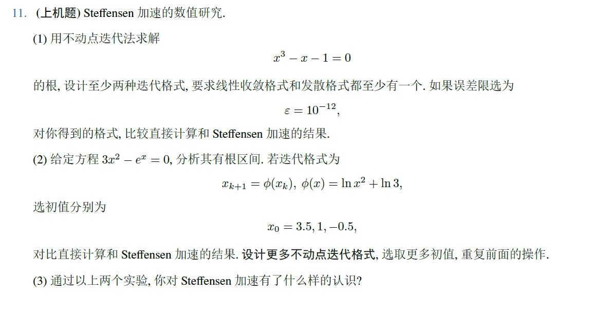

# 非线性方程的求解

> 本项目使用 Jupyter Notebook 进行编写，源代码文件为 `homework2.ipynb` 。

## 题目



## 问题 1

---

### 问题分析

问题 1 要求使用不动点迭代法求解 $x^3 - x-1=0$ 。要求线性收敛格式和发散格式至少有一个。

首先，通过分析，该方程的解在 $[1, 2]$ 中，选中两种以下三种迭代格式：

$$
\begin{equation}
x_{k+1} = x_k^3 - 1
\end{equation}
$$

$$
\begin{equation}
x_{k+1} = \sqrt[3]{x_k + 1}
\end{equation}
$$

$$
\begin{equation}
x_{k+1} = \sqrt{1+\frac{1}{x_{k+1}}}
\end{equation}
$$

Steffensen 加速法的迭代函数为

$$
\begin{equation}
\Phi(x) = x - \frac{[\phi(x)-x]^2}{\phi[\phi(x)]-2\phi(x)+x}
\end{equation}
$$

易证，迭代格式 $(1)$ 在 $[1, 2]$ 上发散，迭代格式 $(2)$ 和 $(3)$ 在 $[1, 2]$ 上线性收敛。将这两个迭代格式都写成函数，分别记为 `phi2` 和 `phi3`。

```python
def phi2(x):
    return (x + 1) ** (1 / 3)


def phi3(x):
    return (1 + 1/x) ** (1/2)
```

### 线性收敛的不动点迭代法

为不动点迭代法设计了一个通用的函数。该函数需要设置迭代方程 `f` 、迭代的初始值 `x0` 、误差限 `error` 、最大迭代次数 `max_iterations` 。当两次迭代计算结果之间的误差小于误差限或迭代次数超过最大次数时，函数退出。

```python
def fixed_point_iteration(f, x0, error=1e-12, max_iterations = 100):
    '''
    Fixed point iteration for finding a fixed point of a function.
    :param f: function
    :param x0: initial guess
    :param error: error tolerance
    :param max_iterations: maximum number of iterations
    '''
    for i in range(max_iterations):
        x1 = f(x0)
        if abs(x1 - x0) < error:
            return i+1, x1
        else:
            x0 = x1

    raise ValueError("Method failed after {} iterations".format(max_iterations))
```

设置迭代方程和初始值，启动代码：

```python
xx0 = 1
print("Fixed point iteration:")
i, x = fixed_point_iteration(phi2, xx0)
print(f'{i} iterations, x = {x:.12f}')
i, x = fixed_point_iteration(phi3,xx0)
print(f'{i} iterations, x = {x:.12f}')
```

结果如下：

```python
Fixed point iteration:
17 iterations, x = 1.324717957245
19 iterations, x = 1.324717957245
```

可以看到迭代格式 $(2)$ 经过 `17` 次迭代后，求得结果为 `1.324717957245` 。

迭代格式 $(3)$ 经过 `19` 次迭代后，求得结果为 `1.324717957245` 。

### Steffensen 加速法求解

使用 Steffensen 加速法进行求解。该函数需要设置迭代方程 `f` 、迭代的初始值 `x0` 、误差限 `error` 、最大迭代次数 `max_iterations` 。当两次迭代计算结果之间的误差小于误差限或迭代次数超过最大次数时，函数退出。代码如下：

```python
def steffensen(f, x0, error=1e-12, max_iterations = 100):
    '''
    Steffensen's method for finding a fixed point of a function.
    :param f: function
    :param x0: initial guess
    :param error: error tolerance
    :param max_iterations: maximum number of iterations
    '''
    for i in range(max_iterations):
        y1 = f(x0)
        y2 = f(y1)
        try:
            x1 = x0 - (y1 - x0) ** 2 / (y2 - 2 * y1 + x0)
        except ZeroDivisionError:
            print("Division by zero!")
            return i+1, x0
        if abs(x1 - x0) < error:
            return i+1, x1
        else:
            x0 = x1

    raise ValueError("Method failed after {} iterations".format(max_iterations))
```

设置启动代码：

```python
xx0 = 1
print("Steffensen's method:")
i, x = steffensen(phi2, xx0)
print(f'{i} iterations, x = {x:.12f}')
i, x = steffensen(phi3, xx0)
print(f'{i} iterations, x = {x:.12f}')
```

结果如下：

```shell
Steffensen's method:
Division by zero!
4 iterations, x = 1.324717957245
4 iterations, x = 1.324717957245
```

可以看到，在使用了 Steffensen 加速法后，迭代格式 (2) 经过 `4` 次迭代后，求得结果为 `1.324717957245` 。迭代格式 (3) 经过 `4` 次迭代后，求得结果为 `1.324717957245` 。

但是在使用迭代格式 $(2)$ 进行求解时，程序出现了除零异常，该除零异常可能是不同的迭代格式和不同的初始值导致的。

## 问题 2

---

### 有根区间分析

设 $f(x) = 3x^2-e^x$ 。通过分析 $f'(x)$ ，可得 $f(x)$ 先单调递减，后单调递增，再单调递减。


利用图解法，可以看到 $f(x)=0$ 的在 $[-1, 0]$，$[0, 1]$， $[3, 4]$ 内各有一唯一解。


### 求解题目中的迭代格式

设置迭代格式和初值，启动程序：

```python
import math as m

def phi1(x):
    return m.log(x ** 2) + m.log(3)

xx0 = [3.5, 1, -0.5]

print("Fixed point iteration:")
for x0 in xx0:
    i, x = fixed_point_iteration(phi1, x0)
    print(f'{x0:5}:{i:4} iterations, x = {x:.12f}')


print("Steffensen's method:")
for x0 in xx0:
    i, x = steffensen(phi1, x0)
    print(f'{x0:5}:{i:4} iterations, x = {x:.12f}')
```

运算结果如下：

```python
Fixed point iteration:
  3.5:  42 iterations, x = 3.733079028632
    1:  51 iterations, x = 3.733079028632
 -0.5:  50 iterations, x = 3.733079028632
Steffensen's method:
  3.5:   4 iterations, x = 3.733079028633
Division by zero!
    1:   6 iterations, x = 0.910007572489
 -0.5:   5 iterations, x = -0.458962267537
```

可以看到，不动点迭代法使用以上的初值，最终都收敛到了 `3.733079028632` ，且迭代次数基本在几十次这一量级。而使用 Steffensen 加速法进行计算时，分别收敛到了 `-0.458962267537` ，`0.910007572489`，`3.733079028633`，得到了理论分析的三个零点。而且 Steffensen 加速法的迭代次数比不动点迭代法至少小一个量级。

### 设计其他的迭代格式

设计以下的一些迭代格式：

$$
\begin{equation}
x_{k+1} = \sqrt{\frac{e^{x_k}}{3}}
\end{equation}
$$

$$
\begin{equation}
x_{k+1} = \frac{e^{x_k}}{3x_k}
\end{equation}
$$

取初值 $x_0 = -1, -0.5, -0.1, 0.1, 0.5, 1, 2$，使用如下的程序求解：

```python
xx0 = [-1, -0.5, -0.1, 0.1, 0.5, 1, 2]

print("Fixed point iteration:")
print("phi1(x) = ln(x^2) + ln(3)")
for x0 in xx0:
    i, x = fixed_point_iteration(phi1, x0)
    print(f'{x0:5}:{i:4} iterations, x = {x:.12f}')
print()

print("phi2(x) = (exp(x)/3)^(1/2)")
for x0 in xx0:
    i, x = fixed_point_iteration(phi2, x0)
    print(f'{x0:5}:{i:4} iterations, x = {x:.12f}')
print()

print("phi3(x) = exp(x)/(3*x)")
for x0 in xx0:
    i, x = fixed_point_iteration(phi3, x0)
    print(f'{x0:5}:{i:4} iterations, x = {x:.12f}')
print()


print("Steffensen's method:")
print("phi1(x) = ln(x^2) + ln(3)")
for x0 in xx0:
    i, x = steffensen(phi1, x0)
    print(f'{x0:5}:{i:4} iterations, x = {x:.12f}')
print()

print("phi2(x) = (exp(x)/3)^(1/2)")
for x0 in xx0:
    i, x = steffensen(phi2, x0)
    print(f'{x0:5}:{i:4} iterations, x = {x:.12f}')
print()

print("phi3(x) = exp(x)/(3*x)")
for x0 in xx0:
    i, x = steffensen(phi3, x0)
    print(f'{x0:5}:{i:4} iterations, x = {x:.12f}')
```

求得结果如下：

```shell
Fixed point iteration:
phi1(x) = ln(x^2) + ln(3)
   -1:  51 iterations, x = 3.733079028632
 -0.5:  50 iterations, x = 3.733079028632
 -0.1:  43 iterations, x = 3.733079028632
  0.1:  43 iterations, x = 3.733079028632
  0.5:  50 iterations, x = 3.733079028632
    1:  51 iterations, x = 3.733079028632
    2:  47 iterations, x = 3.733079028632

phi2(x) = (exp(x)/3)^(1/2)
   -1:  36 iterations, x = 0.910007572488
 -0.5:  36 iterations, x = 0.910007572488
 -0.1:  35 iterations, x = 0.910007572488
  0.1:  35 iterations, x = 0.910007572488
  0.5:  34 iterations, x = 0.910007572488
    1:  33 iterations, x = 0.910007572489
    2:  37 iterations, x = 0.910007572489

phi3(x) = exp(x)/(3*x)
Division by zero!
   -1:   8 iterations, x = 0.000000000000
Division by zero!
 -0.5:  14 iterations, x = 0.000000000000
Division by zero!
 -0.1:   7 iterations, x = 0.000000000000
  0.1:  19 iterations, x = 0.910007572489
  0.5:  12 iterations, x = 0.910007572489
    1:  12 iterations, x = 0.910007572489
    2:  13 iterations, x = 0.910007572489

Steffensen's method:
phi1(x) = ln(x^2) + ln(3)
   -1:  12 iterations, x = 0.910007572489
 -0.5:   5 iterations, x = -0.458962267537
Division by zero!
 -0.1:   9 iterations, x = 3.733079028633
  0.1:   9 iterations, x = 3.733079028633
  0.5:   7 iterations, x = 3.733079028633
Division by zero!
    1:   6 iterations, x = 0.910007572489
    2:   6 iterations, x = 3.733079028633

phi2(x) = (exp(x)/3)^(1/2)
   -1:   5 iterations, x = 0.910007572489
 -0.5:   5 iterations, x = 0.910007572489
 -0.1:   5 iterations, x = 0.910007572489
  0.1:   5 iterations, x = 0.910007572489
  0.5:   5 iterations, x = 0.910007572489
    1:   4 iterations, x = 0.910007572489
Division by zero!
    2:   6 iterations, x = 0.910007572489

phi3(x) = exp(x)/(3*x)
   -1:   8 iterations, x = -0.458962267537
 -0.5:   5 iterations, x = -0.458962267537
 -0.1:  11 iterations, x = -0.458962267537
  0.1:   7 iterations, x = 3.733079028633
  0.5:   5 iterations, x = 0.910007572489
    1:   4 iterations, x = 0.910007572489
    2:   5 iterations, x = 0.910007572489
```

## 问题 3

通过上述的两个实验，可以看出：

1. 相较于不动点迭代法，Steffensen 加速法收敛速度更快。
2. 相较于不动点迭代法，Steffensen 加速法更容易在较大范围上收敛，对 $\phi(x)$ 的要求比不动点迭代法低。例如实验 2，不动点迭代法对迭代格式的要求较高，在不同区间上需要使用不同迭代格式，才可以求出方程的三个解；而使用 Steffensen 加速法，三种迭代格式中有两种可以直接求得方程的三个解。
3. Steffensen 对初值的选取有一定的要求，如果选取的值不合适，可能无法获取方程所有的解。
